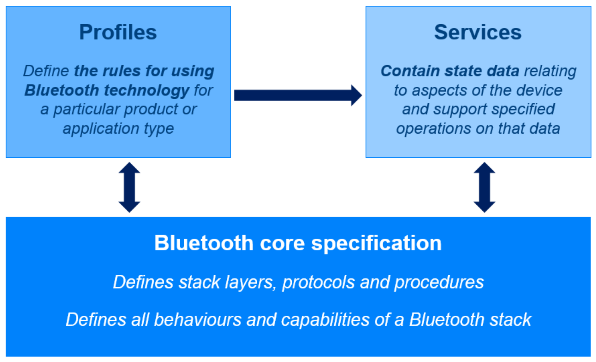
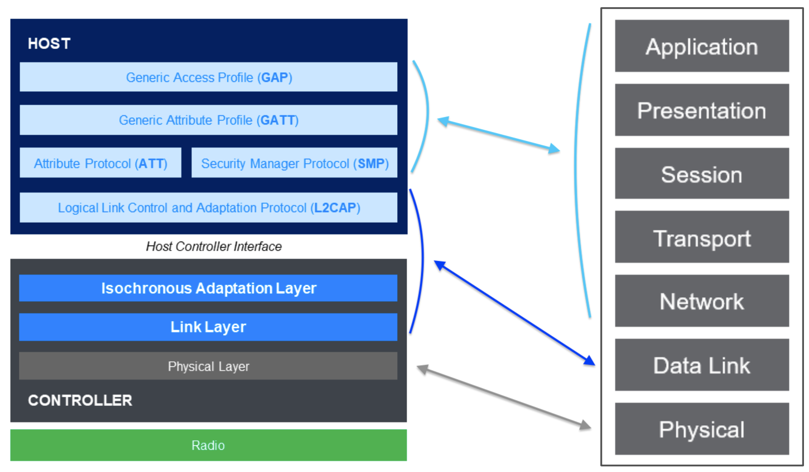
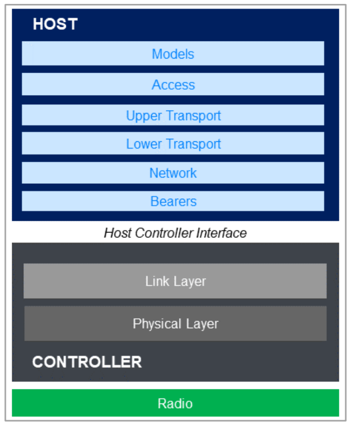

BLE
====

Introduction
------------

BLE is a highly flexible stack. It is designed to enable a wide range of applications, including point-to-point and point-to-multipoint communication. 
BLE is optimized for low power consumption. To achieve this the design assigns asymmetrical capabilities and responsibilities to devices, 
seeking to ensure that devices with a relatively plentiful source of power such as a large smartphone battery do more of the heavy lifting than peer devices 
running on coin cell batteries. One-to-one communication between two devices is supported by both connection-oriented communication and connectionless communication. 
One-to-many communication is supported by connectionless broadcasting.

Specifications Documents
------------------------

`Bluetooth Core Specification <https://www.bluetooth.com/specifications/bluetooth-core-specification/>`_ is the primary specification for both BLE and Bluetooth Classic.
It defines the architecture, procedures and protocols of Bluetooth LE. 

How products use Bluetooth such that they are interoperable is covered by collections of specifications of two special types known as profiles and services.
When two Bluetooth LE devices are communicating over a connection, it is usually the case that a client / server relationship has been formed.
Profile specifications define the roles that related devices (like the smartwatch and key fob) assume and in particular, define the behavior of the client 
device and the data on the connected server that it should work with.

State data on servers resides in formally defined data items known as characteristics and
descriptors2. Characteristics and descriptors are grouped inside constructs known as services.
Services provide a context within which to assign meaning and behaviors to the characteristics and
descriptors that they contain.
A service specification defines a single service along with the characteristics and descriptors that it
contains. The behaviors to be exhibited by the device hosting the service in response to various
conditions and state data values are defined in the service specification.

The relationship between the Bluetooth Core Specification and the profiles and services is as follows:

.. _ble_stack:

BLE Stack
---------

The Bluetooth LE stack consists of a number of layers and functional modules, some of which are
mandatory and some of which are optional. These parts of the stack are distributed across two
major architectural blocks known as the :term:`Host`  and the :term:`Controller` and a logical interface called the :term:`Host Controller Interface (HCI)<HCI>` that defines a way 
in which these two components may communicate.

The *Host* is often something like an operating system. The *Controller* is often a system on a chip (SoC). This
is not necessarily the case however and the Bluetooth specifications do not mandate any such
implementation details. What's important is that the Host and Controller act as separate logical
containers in the architecture which *may be implemented in physically separate components in
some way, with a standard interface defined for communication between them. This allows a
Bluetooth system to consist of host and controller components from different manufacturers.*

Bluetooth mesh (as part of BLE) uses an alternative stack shown in the image below:

The table below briefly describes the responsibilities of each layer in the BLE stack:

.. table:: BLE Stack Layer Responsibilities
   :class: longtable
   :widths: auto
   :align: left
   :name: ble_stack_layers_table

   +----------------------------+------------------------------------------------------+
   | Layer                      | Key Responsibilities                                 |
   +============================+======================================================+
   | Physical Layer             | Defines all aspects of Bluetooth technology that are |
   |                            | related to the use of radio (RF) including           |
   |                            | modulation schemes, frequency bands, channel use,    |
   |                            | transmitter and receiver characteristics.            |
   |                            |                                                      |
   |                            | Several distinct, supported combinations of physical |
   |                            | layer parameters are defined and are referred to as  |
   |                            | PHYs.                                                |
   +----------------------------+------------------------------------------------------+
   | Link Layer                 | Defines air interface packet formats, bit stream     |
   |                            | processing procedures such as error checking, a      |
   |                            | state machine and protocols for over-the-air         |
   |                            | communication and link control.                      |
   |                            |                                                      |
   |                            | Defines several distinct ways of using the           |
   |                            | underlying radio for connectionless, connection-     |
   |                            | oriented and isochronous communication known as      |
   |                            | logical transports.                                  |
   +----------------------------+------------------------------------------------------+
   | Isochronous Adaptation     | Allows different frame durations to be used by       |
   | Layer (ISOAL)              | devices using isochronous communication.             |
   |                            |                                                      |
   |                            | Performs segmentation and reassembly of framed PDUs  |
   |                            | or fragmentation and recombination of unframed PDUs. |
   +----------------------------+------------------------------------------------------+
   | Host Controller Interface  | Provides a well-defined functional interface for     |
   | (HCI)                      | bi-directional communication of commands and data    |
   |                            | between the host component and the controller.       |
   |                            |                                                      |
   |                            | Supported by any one of several physical transport   |
   |                            | implementations.                                     |
   +----------------------------+------------------------------------------------------+
   | Logical Link Control and   | Acts as a protocol multiplexer within the host,      |
   | Adaptation Protocol        | ensuring protocols are serviced by the appropriate   |
   | (L2CAP)                    | host component.                                      |
   |                            |                                                      |
   |                            | Performs segmentation and reassembly of PDUs/SDUs    |
   |                            | between the layer below and the layer above L2CAP.   |
   +----------------------------+------------------------------------------------------+
   | Security Manager Protocol  | A protocol used during the execution of security     |
   | (SMP)                      | procedures such as pairing.                          |
   +----------------------------+------------------------------------------------------+
   | Attribute Protocol         | A protocol used by an ATT client and an ATT server   |
   | (ATT)                      | which allows the discovery and use of data in the    |
   |                            | server's attribute table.                            |
   +----------------------------+------------------------------------------------------+
   | Generic Attribute Profile  | Defines high level data types known as services,     |
   | (GATT)                     | characteristics and descriptors in terms of          |
   |                            | underlying attributes in the attribute table.        |
   |                            |                                                      |
   |                            | Defines higher level procedures for using ATT to     |
   |                            | work with the attribute table.                       |
   +----------------------------+------------------------------------------------------+
   | Generic Access Profile     | Defines operational modes and procedures which may   |
   | (GAP)                      | be used when in a non-connected state such as how    |
   |                            | to use advertising for connectionless communication  |
   |                            | and how to perform device discovery.                 |
   |                            |                                                      |
   |                            | Defines security levels and modes.                   |
   |                            |                                                      |
   |                            | Defines some user interface standards.               |
   +----------------------------+------------------------------------------------------+

Further details on each layer appears read below:

.. toctree::
    :maxdepth: 2

    physical_layer
    link_layer

