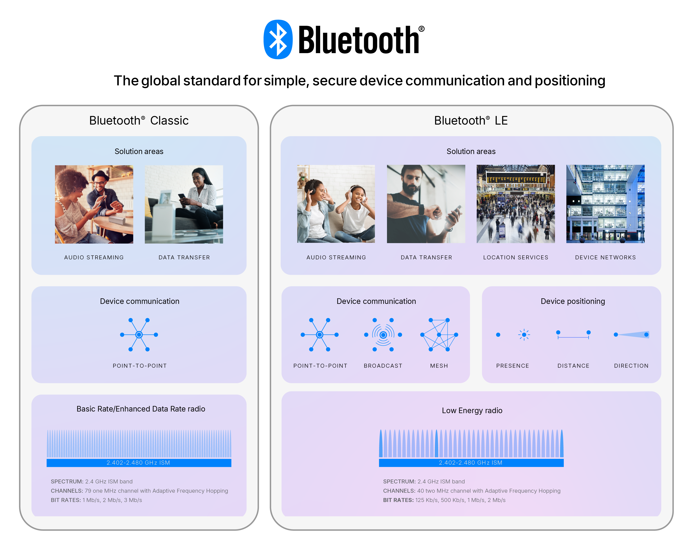

Overview
################

:term:`Bluetooth` is a flexible wireless technology standard for: audio streaming, data transfer, and device control. Bluetooth is divided into two main categories: 
:term:`Bluetooth Classic` and :term:`Bluetooth Low Energy (BLE)<BLE>`. Bluetooth Classic is the original version of Bluetooth, which is used for audio streaming and file transfer. 
BLE is a version of Bluetooth that is optimized for low power consumption.

Bluetooth Classic
*****************
The :term:`Bluetooth Classic` radio, also referred to as Bluetooth Basic Rate/Enhanced Data Rate (BR/EDR), is a low power radio that streams 
data over 79 channels in the 2.4GHz unlicensed industrial, scientific, and medical (:term:`ISM`) frequency band. 
Supporting point-to-point device communication, :term:`Bluetooth Classic` is mainly used to enable wireless audio streaming and has become the standard radio 
protocol behind wireless speakers, headphones, and in-car entertainment systems. The :term:`Bluetooth Classic` radio also enables data transfer applications, 
including mobile printing.

Bluetooth Low Energy (BLE)
**************************
The :term:`Bluetooth LE<BLE>` radio is designed for very low power operation. Transmitting data over 40 channels in the 2.4GHz unlicensed :term:`ISM` frequency band, 
the Bluetooth LE radio provides developers a tremendous amount of flexibility to build products that meet the unique connectivity requirements of their market. 
Bluetooth LE supports multiple communication topologies, including point-to-point, broadcast and mesh. While initially known for its device communications capabilities, 
Bluetooth LE is now also widely used as a device positioning technology to address the increasing demand for high accuracy location services. 
Bluetooth LE now includes features that enable one device to determine the presence, distance, and direction of another device. 

Comparison
**********
The table below compares the key characteristics of Bluetooth Classic and Bluetooth Low Energy.

.. list-table:: Bluetooth Classic vs Bluetooth Low Energy
    :header-rows: 1
    :widths: auto
    :stub-columns: 1
    :align: left

    * - Feature
      - Bluetooth Classic
      - Bluetooth Low Energy (BLE)
    * - Frequency Band
      - 2.4GHz ISM band (2.402 – 2.480 GHz Utilized)
      - 2.4GHz ISM band (2.402 – 2.480 GHz Utilized)
    * - Channels
      - 79, with 1MHz spacing
      - 40, with 2MHz spacing, 3 advertising channels (37, 38, 39) (?) and 37 data channels (0-36)
    * - Channel Usage
      - Frequency hopping spread spectrum (:term:`FHSS`)
      - Frequency hopping spread spectrum (:term:`FHSS`)
    * - Modulation
      - GFSK, :math:`\pi / 4` DQPSK, 8DPSK
      - GFSK
    * - Data Rate
      - 8DPSK\: 3 Mb/s, :math:`\pi / 4` DQPSK\: 2 Mb/s, GFSK: 1 Mb/s
      - LE 2M PHY\: 2 Mb/s, LE 1M PHY\: 1 Mb/s, LE Coded PHY (S=2)\: 500 Kb/s, LE Coded PHY (S=8)\: 125 Kb/s
    * - TX Power
      - :math:`\leq` 100 mW (+20 dBm)
      - :math:`\leq` 100 mW (+20 dBm)
    * - RX Sensitivity
      - :math:`\leq`-70 dBm
      - LE 2M PHY\: :math:`\leq`-70 dBm, LE 1M PHY\: :math:`\leq`-70 dBm, LE Coded PHY (S=2)\: :math:`\leq`-75 dBm, LE Coded PHY (S=8)\: :math:`\leq`-82 dBm
    * - Communication Topologies
      - Point-to-Point (including piconet)
      - Point-to-Point (including piconet), Broadcast, Mesh
    * - Positioning Features
      - None
      - Presence\: Advertising, Direction\: Direction Finding (AoA/AoD), Distance\: RSSI, Channel Sounding